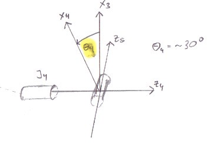
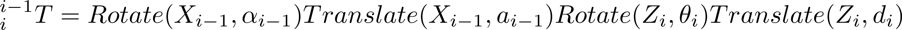
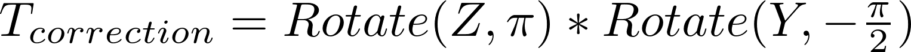
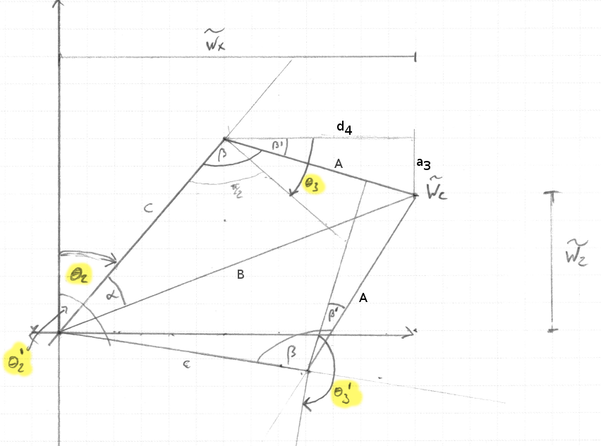
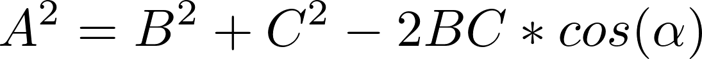
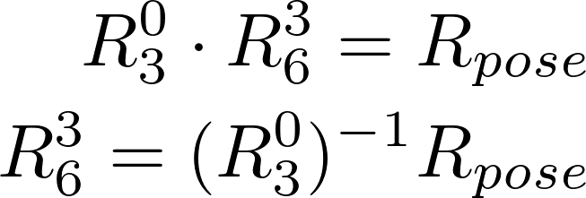

## Project: Kinematics Pick & Place
---

[robotschematic]: ./misc_images/robot-schematic.png

### Kinematic Analysis
To establish an analysis of the Kuka KR210's forward kinematic  I looked at the geometric urdf description in the kr210.urdf.xacro file. The Denavit-Hartenberg parameters for the 6-DOF serial manipulator are chosen according to the convention proposed by Craig, JJ. (2005). Introduction to Robotics. The following schematic depicts the distances and rotation angles between the resultung frame origins.

![kinematic analysis kuka kr210][robotschematic]

#### Rotation angles theta-1 to -6

To get a better understanding of the rotation angles theta1-6 I depicted them separately in a non-zero configuration. The following images show the respective joint angles and their effects: 

Theta 1 (~80°) rotation from X0 to X1 about Z1

Theta 2 (~10°) rotation from X1 to X2 about Z2 \
Theta 3 (~10°) rotation from X2 to X3 about Z3

Theta 4 (~30°) rotation from X3 to X4 about Z4

Theta 5 (~45°) rotation from X4 to X5 about Z5

Theta 6 (~30°) rotation from X5 to X6 about Z6

#### Extract DH parameters describing the kinematic chain

By determining which relative offset definition between the joints in the urdf file corresponds to the respective DH-parameter we end up with the following tables.

URDF relative offsets

Joint | x | y | z 
--- | --- | --- | --- 
J1 | 0 | 0 | 0.33  
J2 | 0.35 | 0 | 0.42
J3 | 0 | 0 | 1.25
J4 | 0.96 | 0 | -0.054
J5 | 0.54 | 0 | 0
J6 | 0.193 | 0 | 0
Jgripper | 0.11 | 0 | 0

Corresponding DH-parameters (composing the distances)

Links | alpha(i-1) | a(i-1) | d(i) | theta(i)
--- | --- | --- | --- | ---
0->1 | 0 | 0 | J1.z + J2.z  | q1
1->2 | - pi/2 | J2.x | 0 | q2 - pi/2
2->3 | 0 | J3.z | 0 | q3
3->4 |  - pi/2 | J4.z | J4.x + J5.x | q4
4->5 | pi/2 | 0 | 0 | q5
5->6 | - pi/2 | 0 | 0 | q6
6->EE | 0 | 0 | J6.x+Jgripper.x | 0

#### Using the DH parameter table you derived earlier, create individual transformation matrices about each joint. In addition, also generate a generalized homogeneous transform between base_link and gripper_link using only end-effector(gripper) pose.

Links | alpha(i-1) | a(i-1) | d(i) | theta(i)
--- | --- | --- | --- | ---
0->1 | 0 | 0 | 0.75 | q1
1->2 | - pi/2 | 0.35 | 0 | q1 - pi/2
2->3 | 0 | 1.25 | 0 | q3
3->4 |  - pi/2 | -0.054 | 1.5 | q4
4->5 | pi/2 | 0 | 0 | q5
5->6 | - pi/2 | 0 | 0 | q6
6->EE | 0 | 0 | 0.303 | 0

Using the Denavit-Hartenberg parameters we can describe the transformation matrix between two adjacent frames as:

This yields the following transformation matrix:

By chaining together the adjacent frame transformation matrices we end up with a transformation between the base-link and the end-effector

To account for the rotational mismatch between the gazebo model of the urdf description and the forward kinematics described by the DH-parameters we have to rotate around Z by 180° and Y by -90°.

#### Forward Kinematics implementation

The code calculating the forward kinematics of the Kuka KR210 is implemented in the file kuka_arm/scripts/FK_experiment.py and was used to validate the correctness of the determined DH-parameters by comparing the resulting position of the end-effector with the simulation using the forward_kinematics environment.

### Decoupling the Inverse Kinematics problems

The fact that the last three revolute joints of the Kuka KR210 have the same origin and form a spherical "wrist" joint allows us to decouple the calculation into solving for the position kinematics of the wrist center and the orientation kinematics of the end effector separately.

First we have to determine the position of the wrist center. This is done by taking the desired position of the end-effector and subtracting a vector with the required orientation scaled to the euclidean distance between the wrist center and the gripper.
For the orientation of the aforementioned vector I first decompose the quaternion representation of the desired pose into the corresponding roll, pitch and yaw values. These values are then used to generate an extrinsic rotation matrix which gets multiplied by the previously described rotational correction matrix to account for the orientation difference between the DH parameters and the gazebo model. The z-component of the resulting matrix is then a unit-vector pointing into the desired direction. Multiplying it by the distance from the wrist to the end-effector and subtracting it from the target gripper position yields the position of the wrist center for this task.

#### Solving position kinematics
Having determined the wrist center we can solve the position kinematics using the first three rotation angles of the Kuka KR210.

For theta 1 there are two possible solutions which, we either turn the arm towards or away from the position of the wrist center.

Once theta1 is determined we can start solving for theta2 and theta3. We calculate the (forward and elevation) distance from the "shoulder" of the robot to the desired wrist center. Then we can fit two triangles to solve the task as depicted in the following schematic. C and A are the distances defined by the geometry of the second and third segment of the Kuka arm. B is the euclidean distance between the robots shoulder (Joint 2) and the wrist center. 

If A + C < B the wrist center is out of the range for the robot.
Otherwise we can fit two triangles to solve for the positioning of the wrist center.

From the law of cosines we can reformulate:

To determine alpha and beta:

Using the DH-parameters table to determine beta-prime which is caused by the offset of Joint4:

We get the following two possible solutions for the angles theta2 and theta3.

#### Solving rotation kinematics

Once we have determined the angles for the first three revolute joints, we can calculate the resulting orientation up to the wrist using the forward kinematics described previously. This yields the rotation matrix R0_3 that can further be used to compute the rest of the rotation pipeline R3_6 by left multiplying the inverse of it.

 

Luckily the rotation matrices are orthgonal matrices which means that the inverse is simply the transpose of the matrix.

 

This let's us compute the numerical solution for the transformation from frame 3 to 6 which can than be compared to the analytical solution of the transformation which has the following form.

By comparing the coefficient we can derive multiple ways of computing the angles theta4, theta5 and theta6.

One solution is for example:

 

Another solution set for the angles can be found using:

This concludes the majority of the solutions for the Kuka KR210's inverse kinematics of a specific pose.

### Project Implementation

Using the provided template in kuka_arm/scripts/IK_server.py I implemented a ROS service which calculates the inverse kinematics proposals for a given set of desired poses.  

During the startup of the service, the DH parameters, the corresponding forward kinematics and the Gazebo rotation correction matrix are prepared.

The callback handler handle_calculate_IK is then waiting to receive request containing a list of poses to determine the respective rotation angles for.

The calculation of the inverse kinematics is implemented as described in the previous section. This yields multiple solutions for the angles of the revolute joints. The established class JointsOptions holds one instantiation of these options and can be used to determine if it's a valid solution, i.e. the proposed angles are within the limits of each joint and pose is within reach of the robot.
Additionally it can calculate the resulting error with respect to the final position and orientation of the end effector using the set of angles.

For each incoming pose all possible and valid solutions are calculated and sorted by the resulting error in the forward kinematics. The solution with the lowest error is picked and passed back to the service caller.

The following video demonstrates a sequence of pick and place tasks using the IK_server to calculate the Kuka KR210's trajectories picking and disposing cans from a shelve into a bin.

After completing multiple pick and place runs the bin is nicely filled.

#### Improvements

In order to speed up the calculation of the inverse kinematics I replaced the used sympy transformation chains with a vastly more efficient numpy implementation. 

One problem I had to tackle was that every once in a while the solution theta1 turning the Kuka arm away from the target wrist position resulted in a better pose which meant that within a trajectory the arm changed between solving two consecutive poses totally differently.
I therefore excluded the calculation of the solution turning away from the target position.

In general a necessary improvement for this task would be to pick consecutive solutions that result in a smooth trajectory rather than just picking the least erroneous pose approximation.    

All in all I'm satisfied with the solution but there's definitely room for improvement.