## Project: Kinematics Pick & Place
---
**Steps to complete the project:**  

1. Set up your ROS Workspace.
2. Download or clone the [project repository](https://github.com/udacity/RoboND-Kinematics-Project) into the ***src*** directory of your ROS Workspace.  
3. Experiment with the forward_kinematics environment and get familiar with the robot.
4. Launch in [demo mode](https://classroom.udacity.com/nanodegrees/nd209/parts/7b2fd2d7-e181-401e-977a-6158c77bf816/modules/8855de3f-2897-46c3-a805-628b5ecf045b/lessons/91d017b1-4493-4522-ad52-04a74a01094c/concepts/ae64bb91-e8c4-44c9-adbe-798e8f688193).
5. Perform Kinematic Analysis for the robot following the [project rubric](https://review.udacity.com/#!/rubrics/972/view).
6. Fill in the `IK_server.py` with your Inverse Kinematics code. 

[//]: # (Image References)

[image1]: ./misc_images/misc1.png
[image2]: ./misc_images/misc3.png
[image3]: ./misc_images/misc2.png
[image1]: ./misc_images/misc1.png
[robotschematic]: ./misc_images/robot-schematic.png

## [Rubric](https://review.udacity.com/#!/rubrics/972/view) Points
### Here I will consider the rubric points individually and describe how I addressed each point in my implementation.  

---
### Writeup / README

#### 1. Provide a Writeup / README that includes all the rubric points and how you addressed each one.  You can submit your writeup as markdown or pdf.  

### Kinematic Analysis
#### 1. Run the forward_kinematics demo and evaluate the kr210.urdf.xacro file to perform kinematic analysis of Kuka KR210 robot and derive its DH parameters.

To establish an analysis of the Kuka KR210's forward kinematic  I looked at the geometric urdf description in the kr210.urdf.xacro file. The Denavit-Hartenberg parameters for the 6-DOF serial manipulator are chosen according to the convention proposed by Craig, JJ. (2005). Introduction to Robotics. The following schematic depicts the distances and rotation angles between the resultung frame origins.

![kinematic analysis kuka kr210][robotschematic]

#### Rotation angles theta-1 to -6

To get a better understanding of the rotation angles theta1-6 I depicted them separately in a non-zero configuration. The following images show the respective joint angles and their effects: 

Theta 1 (~80°) rotation from X0 to X1 about Z1
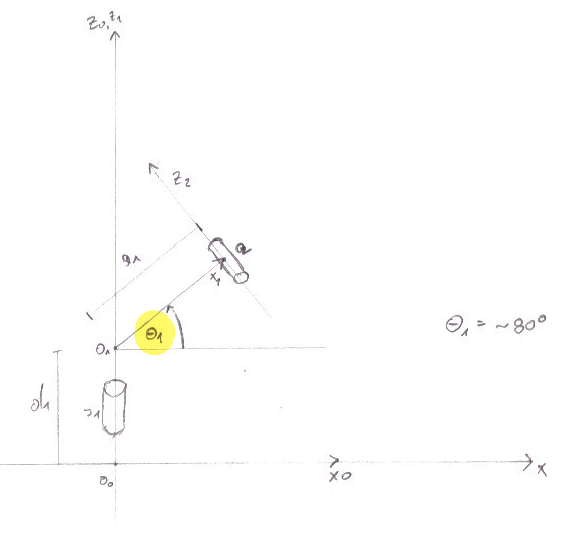

Theta 2 (~10°) rotation from X1 to X2 about Z2 \
Theta 3 (~10°) rotation from X2 to X3 about Z3
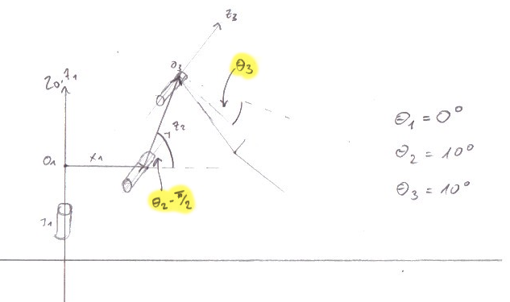

Theta 4 (~30°) rotation from X3 to X4 about Z4
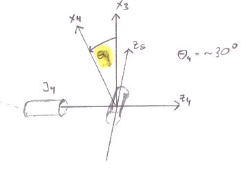

Theta 5 (~45°) rotation from X4 to X5 about Z5
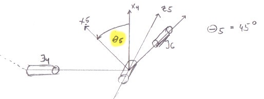

Theta 6 (~30°) rotation from X5 to X6 about Z6
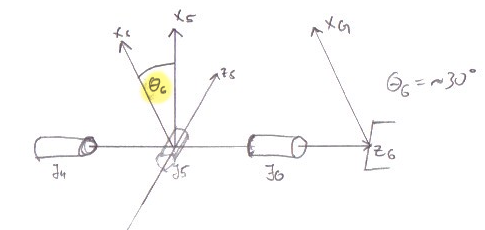

#### Extract DH parameters describing the kinematic chain

By determining which relative offset definition between the joints in the urdf file corresponds to the respective DH-parameter we end up with the following tables.

URDF relative offsets
Joint | x | y | z 
--- | --- | --- | --- 
J1 | 0 | 0 | 0.33  
J2 | 0.35 | 0 | 0.42
J3 | 0 | 0 | 1.25
J4 | 0.96 | 0 | -0.054
J5 | 0.54 | 0 | 0
J6 | 0.193 | 0 | 0
Jgripper | 0.11 | 0 | 0

Corresponding DH-parameters (composing the distances)
Links | alpha(i-1) | a(i-1) | d(i) | theta(i)
--- | --- | --- | --- | ---
0->1 | 0 | 0 | J1.z + J2.z  | q1
1->2 | - pi/2 | J2.x | 0 | q2 - pi/2
2->3 | 0 | J3.z | 0 | q3
3->4 |  - pi/2 | J4.z | J4.x + J5.x | q4
4->5 | pi/2 | 0 | 0 | q5
5->6 | - pi/2 | 0 | 0 | q6
6->EE | 0 | 0 | J6.x+Jgripper.x | 0

#### 2. Using the DH parameter table you derived earlier, create individual transformation matrices about each joint. In addition, also generate a generalized homogeneous transform between base_link and gripper_link using only end-effector(gripper) pose.

Links | alpha(i-1) | a(i-1) | d(i) | theta(i)
--- | --- | --- | --- | ---
0->1 | 0 | 0 | 0.75 | q1
1->2 | - pi/2 | 0.35 | 0 | q1 - pi/2
2->3 | 0 | 1.25 | 0 | q3
3->4 |  - pi/2 | -0.054 | 1.5 | q4
4->5 | pi/2 | 0 | 0 | q5
5->6 | - pi/2 | 0 | 0 | q6
6->EE | 0 | 0 | 0.303 | 0

Using the Denavit-Hartenberg parameters we can describe the transformation matrix between two adjacent frames as:
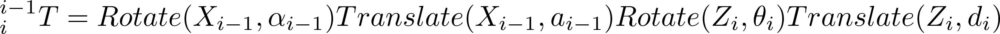
This yields the following transformation matrix:
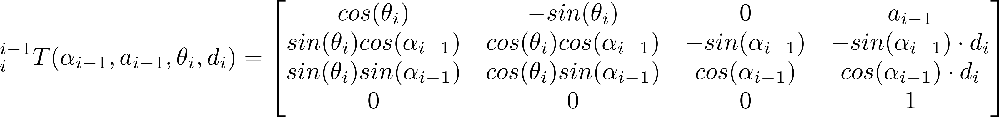

By chaining together the adjacent frame transformation matrices we end up with a transformation between the base-link and the end-effector
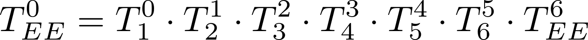

To account for the rotational mismatch between the urdf description and the forward kinematics described by the DH-parameters we have to rotate around Z by 180° and Y by -90°.
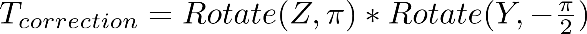

#### Forward Kinematics implementation

The code calculating the forward kinematics of the Kuka KR210 is implemented in the file kuka_arm/scripts/FK_experiment.py and was used to validate the correctness of the determined DH-parameters by comparing the resulting position of the end-effector with the simulation using the forward_kinematics environment.

#### 3. Decouple Inverse Kinematics problem into Inverse Position Kinematics and inverse Orientation Kinematics; doing so derive the equations to calculate all individual joint angles.

The fact that the last three revolute joints of the Kuka KR210 have the same origin and form a spherical "wrist" joint allows us to decouple the calculation into solving for the position kinematics of the wrist center and the orientation kinematics of the end effector separately.

First we have to determine the position of the wrist center. This is done by taking the desired position of the end-effector and subtracting a vector with the required orientation scaled to the euclidean distance between the wrist center and the gripper.
For the orientation of the aforementioned vector I first decompose the quaternion representation of the desired pose into the corresponding roll, pitch and yaw values. These values are then used to generate an extrinsic rotation matrix which gets multiplied by the previously described rotational correction matrix to account for the orientation difference between the DH parameters and the urdf description. The z-component of the resulting matrix is then a unit-vector pointing into the desired direction. Multiplying it by the distance from the wrist to the end-effector and subtracting it from the target gripper position yields the position of the wrist center for this task.

Having determined the wrist center we can solve the position kinematics using the first three rotation angles of the Kuka KR210.

For theta 1 there are two possible solutions which, we either turn the arm towards or away from the position of the wrist center.
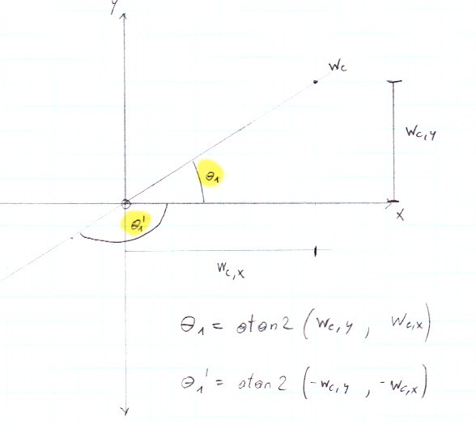
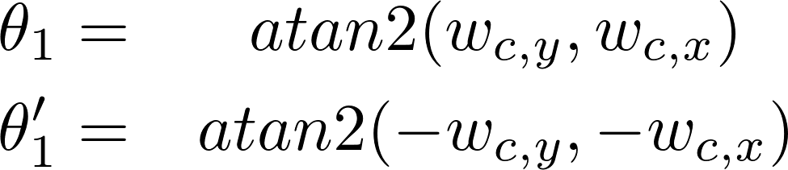

Once theta1 is determined we can start solving for theta2 and theta3. We calculate the (forward and elevation) distance from the "shoulder" of the robot to the desired wrist center. Then we can fit two triangles to solve the task as depicted in the following schematic. C and A are the distances defined by the geometry of the second and third segment of the Kuka arm. B is the euclidean distance between the robots shoulder (Joint 2) and the wrist center. 

If A + C < B the wrist center is out of the range for the robot.
Otherwise we can fit two triangles to solve for the positioning of the wrist center.
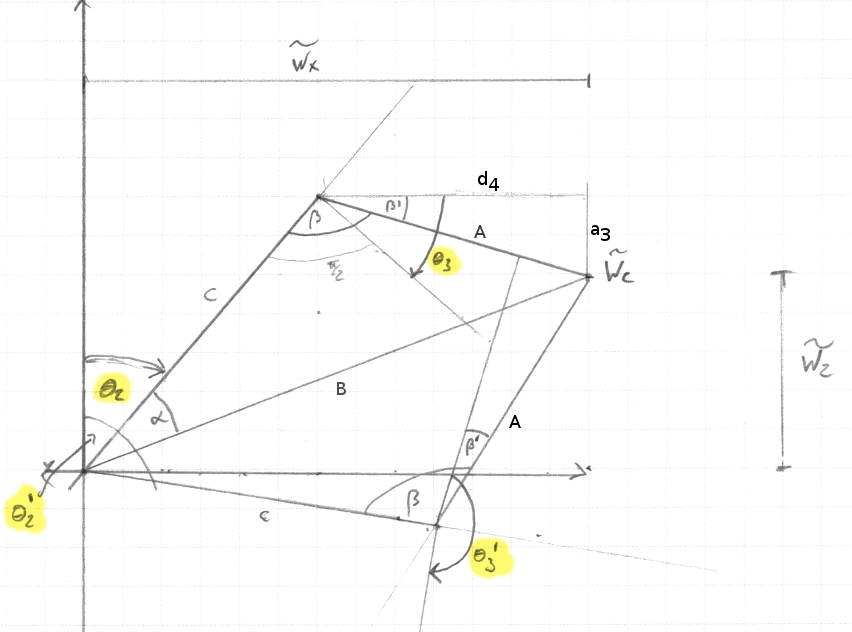

From the law of cosines we can reformulate:
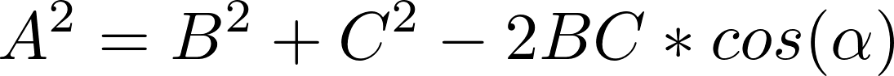
To determine alpha and beta:
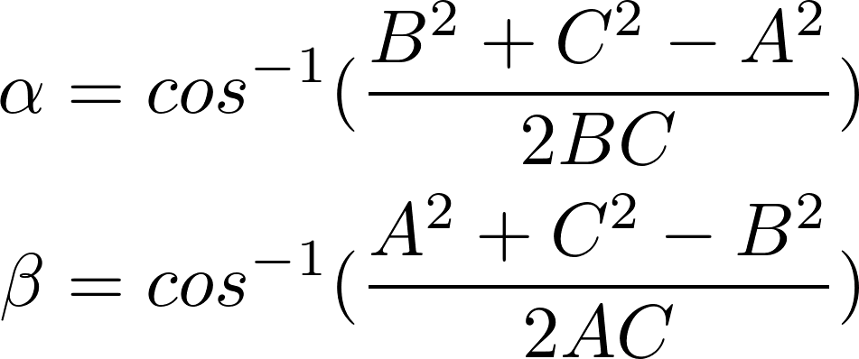
Using the DH-parameters table to determine beta-prime which is caused by the offset of Joint4:
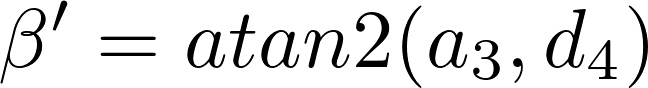
We get the following two possible solutions for the angles theta2 and theta3.
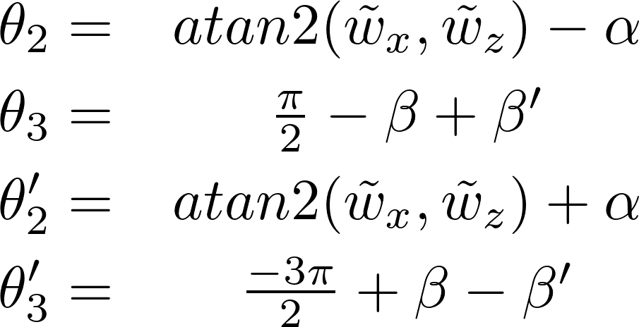

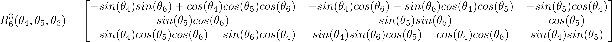
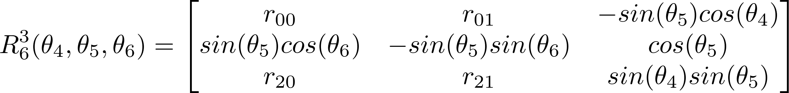

### Project Implementation

#### 1. Fill in the `IK_server.py` file with properly commented python code for calculating Inverse Kinematics based on previously performed Kinematic Analysis. Your code must guide the robot to successfully complete 8/10 pick and place cycles. Briefly discuss the code you implemented and your results. 

Here I'll talk about the code, what techniques I used, what worked and why, where the implementation might fail and how I might improve it if I were going to pursue this project further.  

And just for fun, another example image:
<!-- ![alt text][image3] -->

